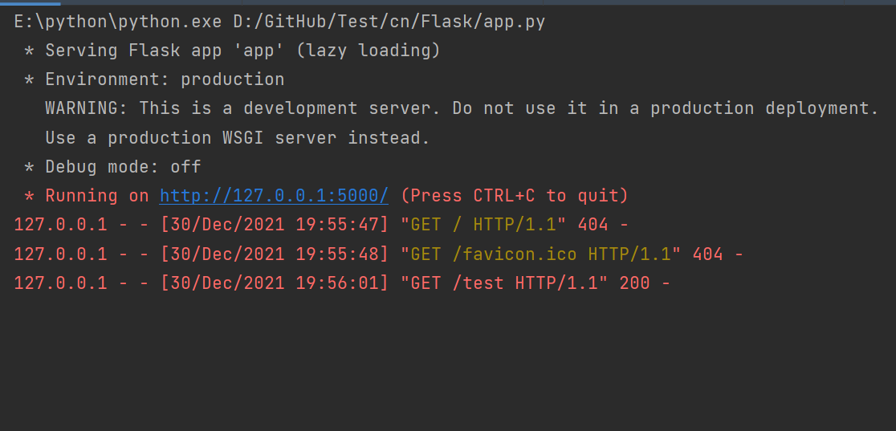
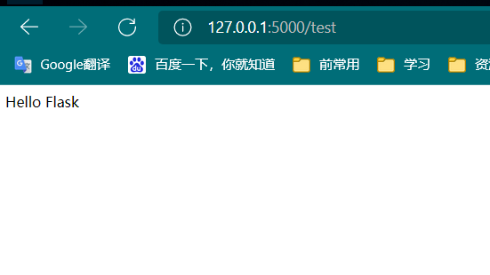

# Flask入门
Flask是一款轻量级的Python的后端框架

**官方文档(2.0.x)**
https://flask.palletsprojects.com/en/2.0.x/
**中文文档**

Flask中文：https://dormousehole.readthedocs.io/en/latest/

W3C：https://www.w3cschool.cn/flask/
# Flask安装
```python
pip install flask [-i][url] 
```

# 过程
1. flask路由（匹配url）
2. http协议
3. abort函数
4. 模板
5. flask数据库（sql插件）
6. 表单
7. 异步请求、网络通信相关（ajax）
8. Web开发上手


# Flask第一个后台程序

服务器跑起来

访问对应映射路径
